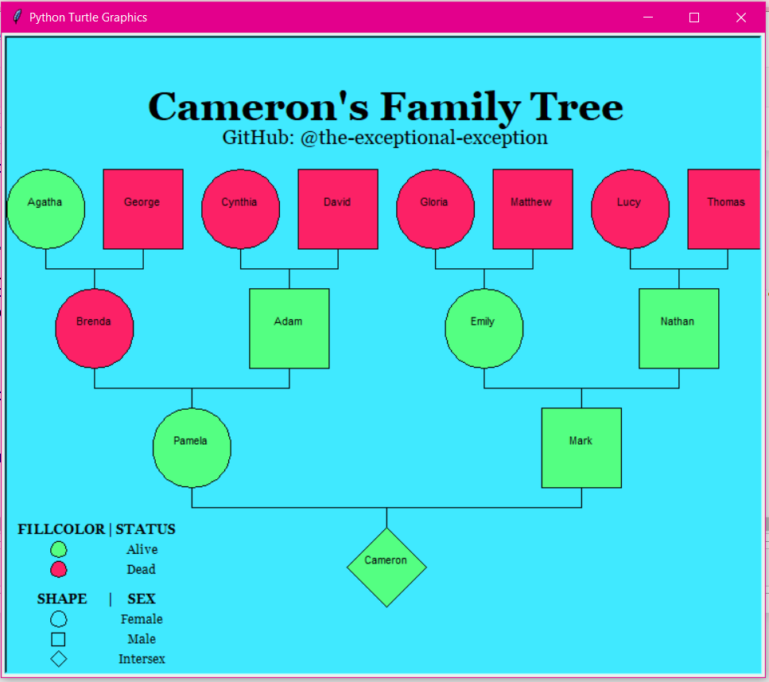

<h1 style="color: aquamarine;  font-family: Georgia;" align="center">Family Tree with Turtle Graphics</h1>

One family. A tree. Some complient turtles. The result? A straightforward visualization of the relationships between 15 family members — in four generations.

Click on the binder badge below to give it a try! Please note that you need to open <strong>family-tree-with-turtle-graphics.ipynb</strong> (i.e. the <strong>interactive</strong> Juputer Notebook).

In case you only want to check out the code, take a look at <a href="family-tree-with-turtle-graphics.py">family-tree-with-turtle-graphics.py</a>

<h1 style="color: aquamarine;  font-family: Georgia;" align="center">Limitations</h1>

In its current state, the application is unfortunately only applicable to the ”traditional family”. However, there are many families with different structures and there is absolutely nothing wrong with that. Preferably, the user would be able to change the tree structure (e.g. add family members and generations) and enter the sex for each individual (i.e. female, male or intersex). In addition, I think that gender should be included and that it should be possible to further specify relationships (e.g. adopted, married or separated). Depending on the intention of creating the family tree, additional information might be useful (e.g. hereditary diseases).

<h1 style="color: aquamarine;  font-family: Georgia;" align="center">Demo</h1>

The user can experiment with different color settings.

It is even possible to enter an arbitrary hex (i.e. hexadecimal) code — without knowing what color it represents. Thus, the user gets to 
see the entered color before deciding whether to use it or to try another one.

Of course, all names are provided by the user.

In addition, the user is asked if each person is alive. In case the user do not wish to differentiate between those who are alive and those who are not, the user can choose the same fillcolor for both categories.

Currently, it is unfortunately only possible to enter the first person's sex.

Step by step, the tree is created.

